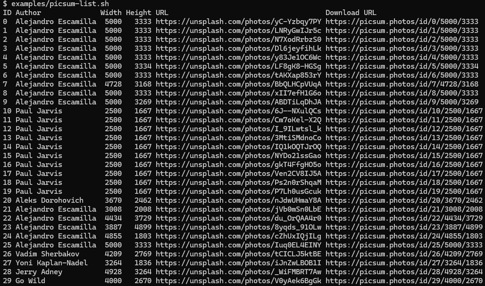

# Picsum List Example

This example uses [picsum-list.sh](./picsum-list.sh) to fetch image metadata from Picsum and format it as a table using `json2table`.

## Script

```bash
#!/bin/bash

export JSON2TABLE_SPEC='{
  "columns": [
    {
      "path": "id",
      "title": "ID"
    },
    {
      "path": "author",
      "title": "Author"
    },
    {
      "path": "width",
      "title": "Width",
      "align": "right"
    },
    {
      "path": "height",
      "title": "Height",
      "align": "right"
    },
    {
      "path": "url",
      "title": "URL"
    },
    {
      "path": "download_url",
      "title": "Download URL"
    }
  ]
}'
curl -s https://picsum.photos/v2/list | json2table
```

## Screenshot


